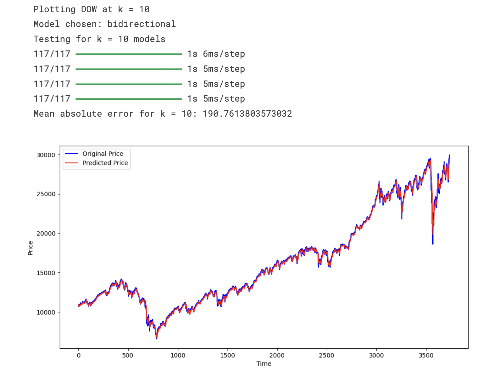
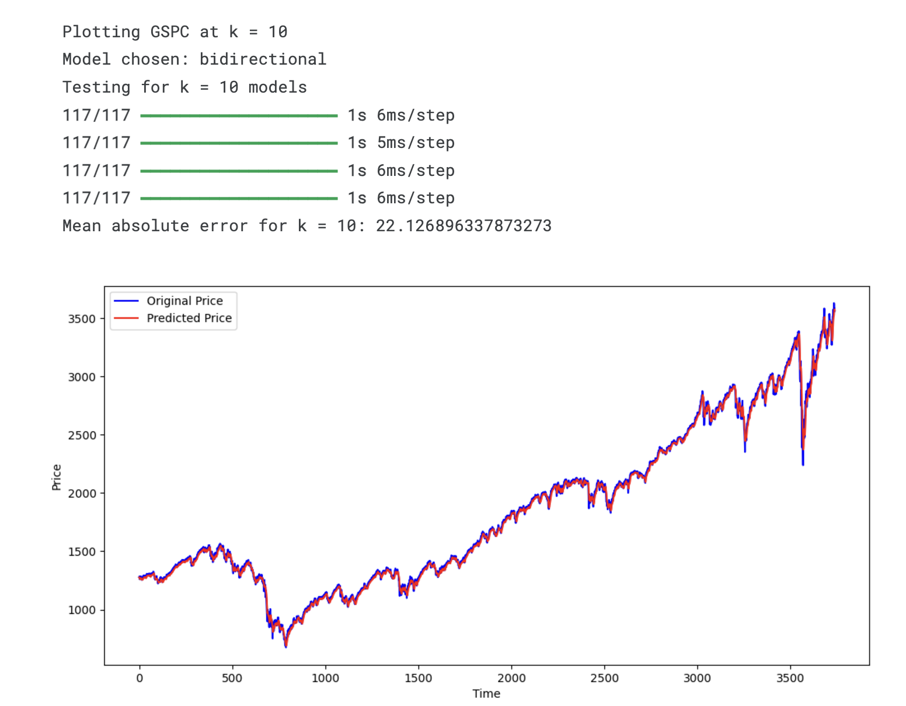

# Analysis of ML and DL models for the task of stock prediction

## This repository contains the implementation and analysis of various Machine Learning (ML) and Deep Learning (DL) models for predicting stock prices. The project explores standard and novel approaches to identify the best-performing models for different sectors and indices.

## Table of Contents
- [Introduction](#introduction)
- [Methods](#methods)
- [Results](#results)
- [Discussion](#discussion)
- [Future Work](#future-work)
- [Appendix](#appendix)
- [References](#references)

## Introduction
The objective of this project is to compare the performance of ML and DL models for time-series forecasting, with a focus on stock market data. Key tasks include:
- Training models on datasets like the Dow Jones Industrial Average (DOW) and S&P 500 (GSPC).
- Extending the analysis to individual stocks from the technology, healthcare, and automotive sectors.
- Exploring the impact of historical input window sizes (e.g., 10, 30, and 60 days) on model performance.

## Methods
The following models were implemented:
1. **Recurrent Neural Networks (RNN) Variants**:
    - Long Short-Term Memory (LSTM)
    - Gated Recurrent Units (GRU)
    - Bidirectional LSTM (BiLSTM)
2. **Hybrid Models**:
    - LSTM-GRU
    - BiLSTM-GRU
    - LSTM-CNN
    - GRU-CNN
    - BiLSTM-CNN
3. **Traditional ML Models**:
    - Decision Tree Regression (DTR)
    - Random Forest Regressor
    - Support Vector Regression (SVR)
    - SVR on residuals

### Feature Engineering
Feature engineering included indicators like moving averages, lagged returns, RSI, and MACD to improve the performance of traditional models.

## Results
Several tables were generated comparing the performance of different models across various datasets. Performance was measured using Mean Absolute Error (MAE) with varying historical window sizes (`k` values).

### Highlights:
- Bidirectional LSTM (BiLSTM) consistently outperformed other models across most indices and sectors, particularly with shorter windows (e.g., `k=10`).
- CNN-based hybrid models, such as CNN-LSTM, demonstrated strong performance for datasets with complex spatial-temporal dependencies.
- Feature engineering substantially improved the accuracy of traditional ML models.

Refer to the [Results section](#results) in the paper for detailed tables and figures.

## Discussion
Key insights from the analysis:
- **BiLSTM Dominance**: BiLSTM models excelled in capturing bidirectional temporal dependencies, making them the most robust choice for time-series forecasting.
- **CNN-LSTM Strength**: CNN-LSTM hybrids performed competitively for datasets requiring spatial feature extraction alongside temporal analysis.
- **Sector-Specific Trends**: Different sectors exhibited unique trends, with shorter windows performing better for healthcare stocks and longer windows benefiting some tech stocks.

## Future Work
Potential directions to extend this research include:
1. Incorporating **attention mechanisms** with LSTM/BiLSTM layers for enhanced interpretability and accuracy.
2. **Advanced hyperparameter tuning** using Bayesian optimization or genetic algorithms.
3. Combining LSTMs with **Transformers** for long-range dependency modeling.
4. Leveraging **Large Language Models (LLMs)** for integrating textual data, such as financial news and sentiment analysis.
5. Building **real-time prediction systems** using tools like Kafka and Spark.
6. Exploring **global stock markets** to assess the generalizability of these models.

## Appendix
The appendix contains visualizations of predictions made by different models for various stocks and indices. These provide a detailed look into the forecasting capabilities of each model.

### Example:

Refer to the `results/` folder for all images.

## References
1. [Stock Price Prediction with Machine Learning](https://medium.com/@varun.tyagi83/stock-price-prediction-with-machine-learning-02c9cce35aab)
2. [Predicting Stock Prices Using Machine Learning](https://neptune.ai/blog/predicting-stock-prices-using-machine-learning)
3. [Stock Price Prediction Topics on GitHub](https://github.com/topics/stock-price-prediction)
4. [Stock Price Prediction using RNN - GitHub](https://github.com/lilianweng/stock-rnn)
5. [Deep Learning and Machine Learning for Stock Prediction](https://github.com/LastAncientOne/Deep_Learning_Machine_Learning_Stock)

## Repository Structure
- `models/`: Implementations of ML/DL models and pre-trained models.  
- `notebooks/`: Jupyter notebooks for experiments and visualizations.  
- `results/`: Prediction plots comparing MAE across models and sectors.  
- `datasets/`: csv files for the 5 indices

## Youtube video link
[Watch our project demonstration on YouTube](https://youtu.be/G-LPSFr-qWw)

